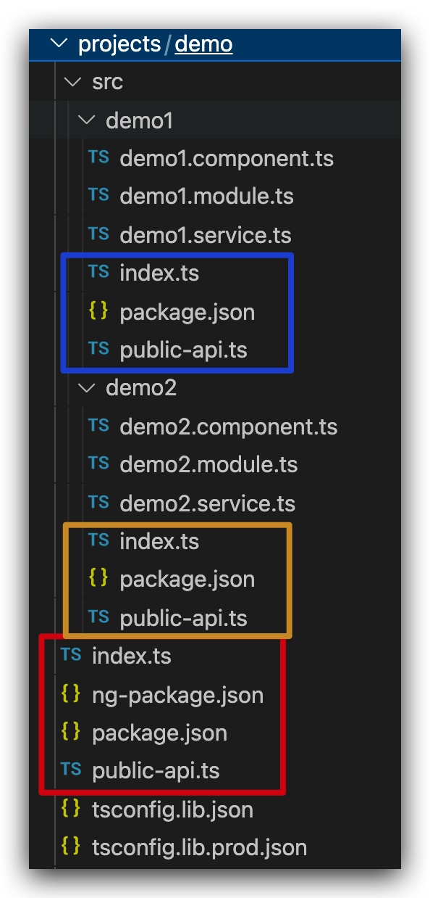
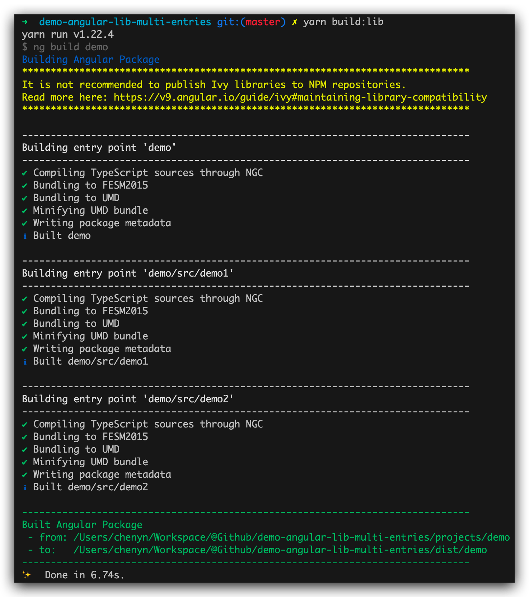
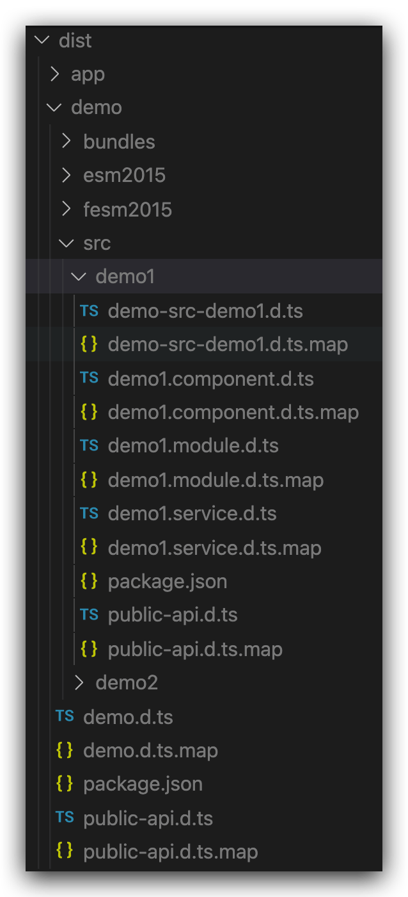

# demo-angular-lib-with-multi-entries

我们经常会遇到一个 Angular Library 内容很多、体积很大的情况。有时我们只需要引用其中的一个元素，就需要将整个包引入编译，这会让我们的应用体积不太可控

这里我们尝试改变 Angular Library 中的构建方法。借助多个二级入口，我们可以将多个功能部分划分成多个模块进行打包。这样只用到其中一个模块时，就可以按需引入而不必全盘引入

值得一提的是，尽管能划分成多个模块，但打包发布成 NPM 包时，仍然是一个包。这种方法不会改变发包的粒度和体积，但会在应用引入之后的构建时减少代码的体积

## 改造

先将功能划分为多个模块，放到不同的目录中。在每个目录下创建 `public-api.ts` 和 `index.ts` 文件，同时创建一个 `package.json`。如下所示

```ts
// src/demo1/index.ts
export * from "./public-api.ts";
```

```ts
// src/demo1/public-api.ts
export * from "./demo1.service";
export * from "./demo1.component";
export * from "./demo1.module";
```

Angular NgPackage 会在构建时搜索这些子包。子包是由一个个的二级入口定义的，二级入口必须在 `package.json` 目录中的子目录中，且拥有一个自己的 `package.json` 文件，其中需要定义一个 `ngPackage` 配置

```ts
// src/demo1/package.json
{
  "ngPackage": {
    "lib": {
      "entryFile": "public-api.ts"
    }
  }
}
```



接下来，在主入口处再创建一个 `index.ts` 和 `public-api.ts`。这个索引文件被称为『 路标 』，用来『 指引 』所有功能的源码位置

```ts
// src/index.ts
export * from "./src/demo1";
export * from "./src/demo2";
```

```ts
// src/public-api.ts
export * from "./src/demo1/demo1.service";
export * from "./src/demo1/demo1.component";
export * from "./src/demo1/demo1.module";
export * from "./src/demo2/demo2.service";
export * from "./src/demo2/demo2.component";
export * from "./src/demo2/demo2.module";
```

现在我们可以执行 `ng build demo` 去构建这个包了。我们会发现 Angular NgPackage 会构建三个包出来



再看下 `dist` 中的构建结果



## 引用

我们尝试在一个 App 中引用它们

先在 `tsconfig.json` 配置一些路径。这些路径只有像我们这样尝试从 App 本地的 `dist` 中引用包结果时需要配置，它们是一个个模拟从 NPM 中引入模块的标识，写法上与真正安装 NPM 包再引入没有差别

```json
"paths": {
  "@demo": [
    "dist/demo/demo",
    "dist/demo"
  ],
  "@demo/demo1": [
    "dist/demo/src/demo1",
    "dist/demo/src/demo-src-demo1"
  ],
  "@demo/demo2": [
    "dist/demo/src/demo2",
    "dist/demo/src/demo-src-demo2"
  ]
}
```

接下来，尝试去引入一些模块或组件。我们既可以只从 `@demo/demo1` 中引入其中的一部分内容，也可以从 `@demo` 的主入口中引入所有内容。当我们只从 `@demo/demo1` 中引入了一部分内容时，其它模块如 `@demo/demo2` 并不会被 App 编译。只要有一处从主入口引入了，那所有内容都会被 App 编译

```ts
// src/app/app.module.ts
import { NgModule } from "@angular/core";
import { BrowserModule } from "@angular/platform-browser";
import { Demo1Service, Demo2Service } from "@demo";
import { Demo1Module } from "@demo/demo1";
import { Demo2Module } from "@demo/demo2";

import { AppComponent } from "./app.component";

@NgModule({
  imports: [BrowserModule, Demo1Module, Demo2Module],
  providers: [Demo1Service, Demo2Service],
  declarations: [AppComponent],
  bootstrap: [AppComponent],
})
export class AppModule {}
```

## 参考

- https://github.com/ng-packagr/ng-packagr/blob/master/docs/secondary-entrypoints.md
- https://medium.com/tunaiku-tech/creating-secondary-entry-points-for-your-angular-library-1d5c0e95600a
- https://zhuanlan.zhihu.com/p/95305012
