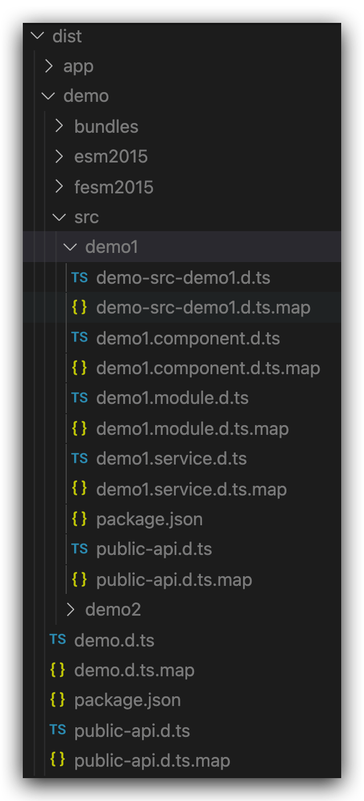

# demo-angular-lib-multi-entries

## Guide


Put independent features into several folders. Create `public-api.ts` and `index.ts` for each every one of them, along with a `package.json`.

```ts
// src/demo1/index.ts
export * from "./public-api.ts";
```

```ts
// src/demo1/public-api.ts
export * from "./demo1.service";
export * from "./demo1.component";
export * from "./demo1.module";
```

```ts
// src/demo1/package.json
{
  "ngPackage": {
    "lib": {
      "entryFile": "public-api.ts"
    }
  }
}
```

Angular NgPackage will try to search for sub-packages, which has a sub-entry(under a folder, with a `package.json` and a `ngPackage` in it).

Then create the main `index.ts` and `public-api.ts` aside with the main `package.json`. That is called a _SignPost_. 

```ts
// src/index.ts
export * from "./src/demo1";
export * from "./src/demo2";
```

```ts
// src/public-api.ts
export * from "./src/demo1/demo1.service";
export * from "./src/demo1/demo1.component";
export * from "./src/demo1/demo1.module";
export * from "./src/demo2/demo2.service";
export * from "./src/demo2/demo2.component";
export * from "./src/demo2/demo2.module";
```

Now we can run `ng build demo` to compile this library. Angular will bundle it into three packages.


See what's like in dist.



## Usage

Try it out in our app.

First, setup some paths in `tsconfig.json`.

Notice this is needed only because we're trying to import something from local dist. The paths here are just reproductions to make it consistent with importing from external NPM packages.

```json
"paths": {
  "@demo": [
    "dist/demo/demo",
    "dist/demo"
  ],
  "@demo/demo1": [
    "dist/demo/src/demo1",
    "dist/demo/src/demo-src-demo1"
  ],
  "@demo/demo2": [
    "dist/demo/src/demo2",
    "dist/demo/src/demo-src-demo2"
  ]
}
```

Then try to import some modules or services. We can either import from a single package like `@demo/demo1` or import all at once from the main package `@demo`. 

```ts
// src/app/app.module.ts
import { NgModule } from "@angular/core";
import { BrowserModule } from "@angular/platform-browser";
import { Demo1Service, Demo2Service } from "@demo";
import { Demo1Module } from "@demo/demo1";
import { Demo2Module } from "@demo/demo2";

import { AppComponent } from "./app.component";

@NgModule({
  imports: [BrowserModule, Demo1Module, Demo2Module],
  providers: [Demo1Service, Demo2Service],
  declarations: [AppComponent],
  bootstrap: [AppComponent],
})
export class AppModule {}
```

 If only one package `@demo/demo1` is imported, app's bundle after compilation will not include other packages, like `@demo/demo2`.

## Refs

- https://zhuanlan.zhihu.com/p/95305012
