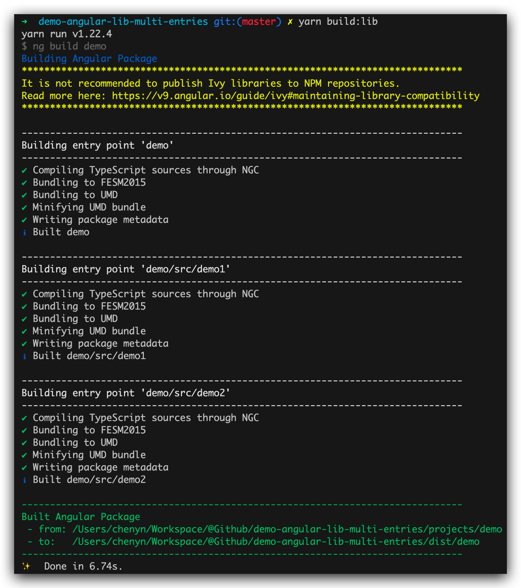

# demo-angular-lib-with-multi-entries

Sometimes our Angular Lib goes too large. We have to import the whole bundle, maybe only need to use one feature in it. This makes our app's bundle size out of control.

This repo tries to fix it from inside the lib package. Using multiple secondary entries helps split several features into different bundles, so we can just use what we need on demand.

It won't change the fact that all packages are still bundled in one NPM package. It tree-shakes the code by using independent entries in apps, to shrink the size of it.

## Guide

First, split independent features into several folders. Create `public-api.ts` and `index.ts` for each every one of them, along with a `package.json`.

```ts
// src/demo1/index.ts
export * from "./public-api.ts";
```

```ts
// src/demo1/public-api.ts
export * from "./demo1.service";
export * from "./demo1.component";
export * from "./demo1.module";
```

Angular NgPackage will search for sub-packages, which has a secondary entry point (under a secondary level folder accoriding to where the main `package.json` belongs, with a `package.json` by itself and a `ngPackage` config in it).

```ts
// src/demo1/package.json
{
  "ngPackage": {
    "lib": {
      "entryFile": "public-api.ts"
    }
  }
}
```


Then, create the main `index.ts` and `public-api.ts` aside with the main `package.json`. That is called a _SignPost_. This name comes from 'Road Sign'. A _SignPost_ helps point out where the source is.

```ts
// src/index.ts
export * from "./src/demo1";
export * from "./src/demo2";
```

```ts
// src/public-api.ts
export * from "./src/demo1/demo1.service";
export * from "./src/demo1/demo1.component";
export * from "./src/demo1/demo1.module";
export * from "./src/demo2/demo2.service";
export * from "./src/demo2/demo2.component";
export * from "./src/demo2/demo2.module";
```

Now we can run `ng build demo` to compile this library. Angular NgPackage will bundle it into three packages.



See what we have in `dist`.


## Usage

Try it out in our app.

First, setup some paths in `tsconfig.json`.

Notice this is only needed as we're trying to import something from local `dist`. The paths here are just reproductions to make it consistent with importing from external NPM packages.

```json
"paths": {
  "@demo": [
    "dist/demo/demo",
    "dist/demo"
  ],
  "@demo/demo1": [
    "dist/demo/src/demo1",
    "dist/demo/src/demo-src-demo1"
  ],
  "@demo/demo2": [
    "dist/demo/src/demo2",
    "dist/demo/src/demo-src-demo2"
  ]
}
```

Then, try to import some modules or services. We can either import from a single package like `@demo/demo1` or import all at once from the main package `@demo`.

If only one package `@demo/demo1` is imported, app's bundle will not include other packages, like `@demo/demo2`. If at least one import from the main entry `@demo`, everything will be considered as necessary to compile.

```ts
// src/app/app.module.ts
import { NgModule } from "@angular/core";
import { BrowserModule } from "@angular/platform-browser";
import { Demo1Service, Demo2Service } from "@demo";
import { Demo1Module } from "@demo/demo1";
import { Demo2Module } from "@demo/demo2";

import { AppComponent } from "./app.component";

@NgModule({
  imports: [BrowserModule, Demo1Module, Demo2Module],
  providers: [Demo1Service, Demo2Service],
  declarations: [AppComponent],
  bootstrap: [AppComponent],
})
export class AppModule {}
```

## Refs

- https://github.com/ng-packagr/ng-packagr/blob/master/docs/secondary-entrypoints.md
- https://medium.com/tunaiku-tech/creating-secondary-entry-points-for-your-angular-library-1d5c0e95600a
- https://zhuanlan.zhihu.com/p/95305012
